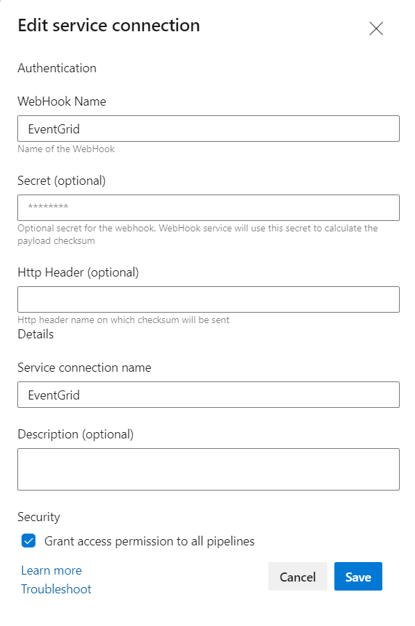
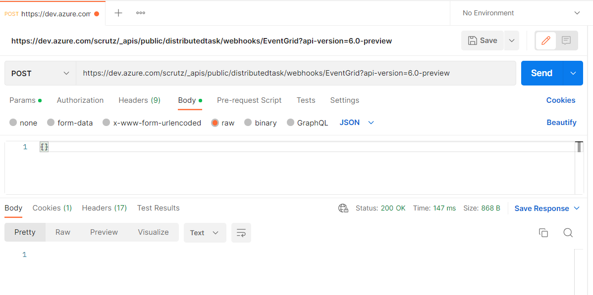
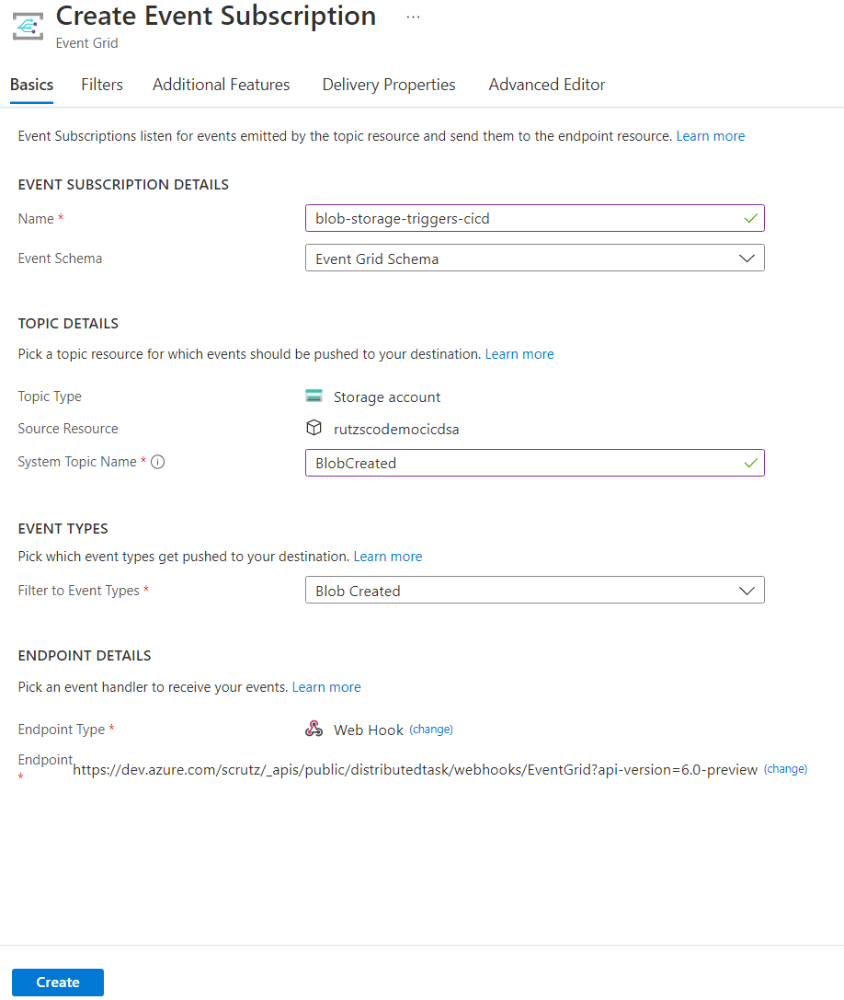

# Sample YAML pipelines with webhook trigger.

### 1. Create Webhook Service Connection

### 2. Create Pipeline with Webhook Trigger

TBD

### 3. Test Webhook Trigger

Request Url Template - "https://dev.azure.com/<ADOOrganization>/_apis/public/distributedtask/webhooks/<WebHookName>?api-version=6.0-preview"

### 4. Create EventGrid Webhook Subscription

## Reference

- https://learn.microsoft.com/en-us/azure/devops/release-notes/2020/pipelines/sprint-172-update