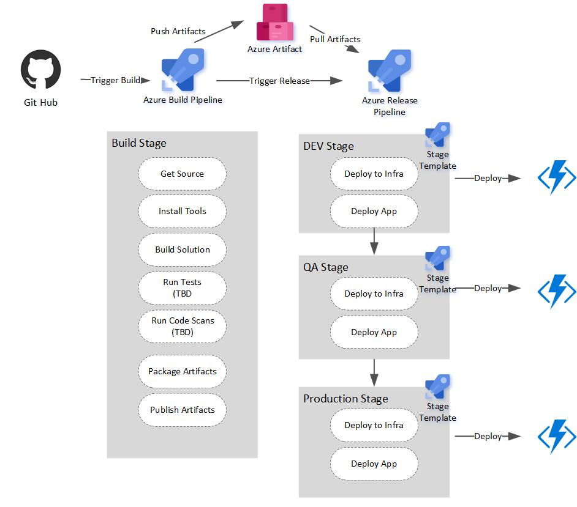

## Sample Function Deployment with YAML multistage pipelines and stage templates.

### Overview

### Key Components

#### Infrastructure as Code

ARM templates are located in the Infrstructure folder and used in the release pipeline. 

#### Build

azure-build-pipelines.yml - contains the build pipeline which build the function app code (.Net) and creates app and infrstructure pipeline artifacts. 

#### Release

azure-release-pipelines.yml - containts the release pipeline that triggers on completion of the build pipeline. This pipeline leverages the azure-release-pipelines-stage-template.yml template to deploy each stage.

azure-release-pipelines-stage-template.yml - Pipeline template that deploys a function app and the app code to a target environment.

